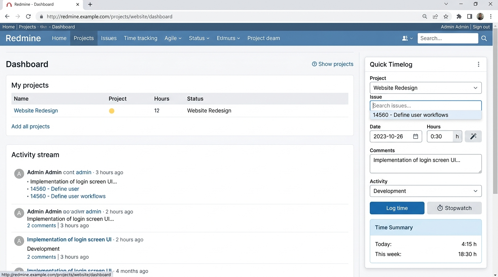
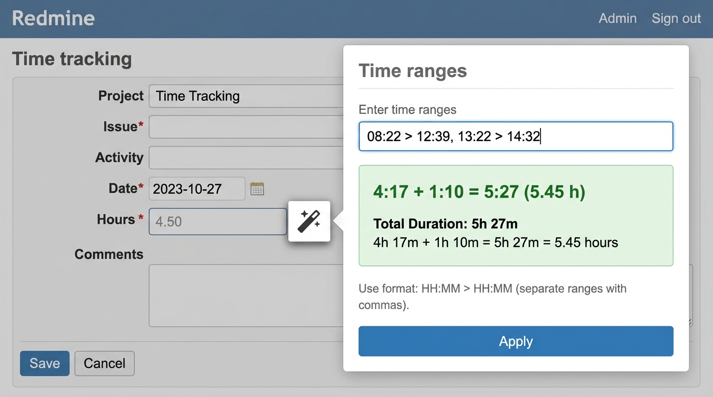
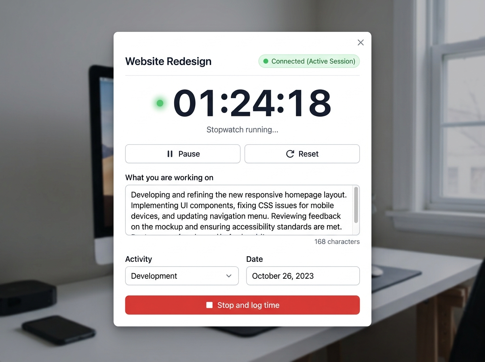

# Quick Timelog for Redmine

> **Fast, effortless, and distraction-free time tracking for Redmine 6.**  
> Log your time in seconds without leaving your current page, calculate natural time ranges automatically, and launch a floating project stopwatch that **never disconnects your session**.

---



---

## 🎯 Objectives & Why Quick Timelog?

Logging time in project management tools is often tedious: navigating through multiple screens, opening ticket edit forms, manually calculating hours between clock times, and constantly fighting against session timeouts.

**Quick Timelog** removes every barrier to time tracking:
- ⚡ **Zero-friction logging**: A compact, AJAX-powered form right on your homepage, My Page, or dedicated page.
- 🪄 **Natural duration calculator ("Magic Wand")**: Type `08:22 > 12:39, 13:22 > 14:32` and let the plugin convert your clock times into exact billable hours.
- ⏱️ **Persistent Project Stopwatch**: Launch a floating companion timer from any project page. It stays alive, allows you to type work notes in real time, and **actively prevents Redmine session timeouts**.

---

## ✨ Key Features

### 1. Fast AJAX Time Logging Widget

A unified, keyboard-friendly widget designed to capture time entries in seconds:

- **Accessible everywhere**:
  - **Welcome Page** (`/`): Right sidebar block for immediate logging upon login.
  - **My Page** (`/my/page`): Addable via the standard *My Page* customizer.
  - **Top Menu**: Instant access via the global "Quick log" link (`/redmine_quick_timelog`).
- **Smart Project & Issue selector**: Your most recently active projects are automatically placed at the top of the dropdown. As you type, issues are searched dynamically via AJAX.
- **Remembers your last project**: Whichever project you logged time on last is preselected the next time you open the widget, on any of its three pages.
- **Responsive layout**: On a wide enough page (the dedicated `/redmine_quick_timelog` page, mostly) fields pair up two-by-two and the recap sidebar moves to the left of the form; on a narrower "My Page" block or home-page column, everything simply stacks.
- **`F9` global shortcut**: Jumps straight to the dedicated quick-log page from anywhere in Redmine, whenever the top-menu entry itself would be visible.
- **Keyboard shortcut**: Hit `Ctrl + Enter` (or `Cmd + Enter`) anywhere in the form to save immediately.
- **Graceful degradation**: Works seamlessly even if JavaScript is disabled (falls back to standard HTTP POST).

---

### 2. Magic Wand: Natural Time Range Parsing



Available on the Quick Timelog widget **and** on all standard Redmine time entry forms (`/time_entries/new`, issue time logging fieldset, etc.).

Instead of doing mental arithmetic or using a separate calculator, enter your clock times:
```text
08:22 > 12:39, 13:22 > 14:32   →   4:17 + 1:10 = 5:27 (5.45 h)
```

The result automatically formats according to your Redmine setting (*Administration → Settings → Display → Timespan format*): `5:27` in `hh:mm` mode, or `5.45` in decimal mode.

#### Supported Syntax Examples

| Input Syntax | Result | Description |
|---|---|---|
| `08:22 > 12:39` | **4:17** | Standard range syntax |
| `9-12` · `9 to 12` · `8:00 -> 12:00` | **3:00** · **4:00** | Flexible separators: `>`, `->`, `to`, `-` |
| `9h`, `9h30`, `09:30`, `0930` | Clock hours | 24-hour or AM/PM format |
| `22:00 > 02:00` | **4:00** | Handles overnight / midnight crossings |
| `9 > 12 > 17` | **8:00** | Multi-segment consecutive periods |
| `1h30`, `45m`, `90 minutes`, `2` | **1:30**, **0:45**, **1:30**, **2:00** | Standalone durations (plain numbers represent hours) |
| `08:00 > 12:00, -30m` | **3:30** | Prefixed with `-` to subtract breaks |
| `1h30 + 45m` | **2:15** | Combinations separated by `,`, `;`, `+` or newlines |

You can also type expressions **directly into the "Hours" field**: it automatically calculates upon leaving the field (*blur* event).

---

### 3. Floating Project Stopwatch (Never Disconnects)



Start tracking live project work with a single click from any project in Redmine:

- **Launch from anywhere in a project**:
  - Click **"Stopwatch"** (⏱) in the project top navigation tab bar.
  - On a project's own overview page, click **"Start the timer"** to the left of
    "Remove from favourites" -- same link style, same spot Redmine itself uses for
    that kind of action.
  - Or click the **⏱** button next to the title of the Quick Timelog widget.
  - Or, from an issue's own page, click **"Start the timer"** to the left of its
    Edit / Log time / Watch / Copy icons -- the issue is preselected in the popup.
- **Dedicated standalone popup**: Sized perfectly (480 × 680 px) to float neatly next to your IDE, terminal, or design tools.
- 🟢 **Anti-disconnect Heartbeat ("Never logs you out")**:
  - The popup runs an active background keepalive heartbeat every 2 minutes.
  - It continuously refreshes both Redmine's inactivity timeout (`session[:atime]`) and maximum session lifetime (`session[:ctime]`).
  - You will **never lose your session or work notes** due to an idle timeout while the timer is running.
- **Live work notes textarea**:
  - A prominent textarea allows you to jot down thoughts, bullet points, and task details while working.
  - **Instant local persistence (`localStorage`)**: Every second and keystroke is saved locally in real-time. If you accidentally close the popup or restart your browser, your elapsed time and comments are restored immediately.
- **Pause & Resume**: Put the timer on hold during lunch or meetings without losing precision. Keepalive remains active while paused.
- **Stop & Auto-Close**: Clicking **"Stop and log time"** computes the duration, creates the `TimeEntry` on the project with your comments and activity, and **automatically closes the popup window**.
- **Remembers the actual schedule**: the real clock range the timer ran over (e.g. `14:32 > 16:10`, pauses included) is kept in the *Schedule* custom field alongside the computed total -- see [Custom fields](#-custom-fields).
- 🔔 **Browser notifications**: two independent, configurable check-ins, both while
  the timer is actually running:
  - a one-time nudge once the *current, uninterrupted* run passes a configurable
    number of hours (4 by default) -- pausing and resuming starts a fresh count;
  - a nudge the moment the wall clock passes any of a configurable list of check-in
    times (e.g. `12:30, 18:00`), once per time per day.
  Both use the standard HTML5 Notification API and need the browser's permission,
  requested when the popup opens; they're silently skipped if that's denied.

### 4. Collapsible History & Coaching Colours

Below the "Today" list, a collapsible tree covers the days before today (how many is
set in *Configure*): day → project → activity, each row carrying its own cumulated
total. It's built with plain HTML `<details>`, so every day and every project inside it
opens and closes on its own, with no JavaScript required for that part.

- **Click a day to log against it**: clicking the date (not the disclosure arrow)
  preselects that day in the form right next to the tree, ready for a forgotten entry.
- **Working-days highlighting** *(optional, off by default)*: a working day with
  nothing logged on it at all is shown in orange.
- **Project links go to the project's logged time**: in both the "Today" list and the
  tree, a project name links to that project's own time-entries report, not its
  overview page.
- **A typical week, coloured against reality**: from your own account page (see
  below), enter how many hours you expect to work on each weekday. Days under that
  target turn orange, and a day at exactly zero hours turns red -- red always wins
  over the plain "missing" orange above.

### 5. Your Typical Week

On *My account* (`/my/account`), a small grid lets you enter the hours you expect to
work on each day of the week. It's saved to your own preferences (nothing shared, no
core page is modified) and immediately powers the colours described above -- leave a
day blank to say "no target for that day", which is also how weekends are usually left.

---

---

## 📋 Prerequisites

Before installing Quick Timelog, make sure your environment meets the following requirements:

| Component | Requirement | Notes |
|---|---|---|
| **Redmine** | `>= 6.0.0` | Developed and verified against the Redmine 6.1.1 source tree |
| **Ruby** | `>= 3.1` | Standard Redmine 6 Ruby runtimes |
| **Rails** | `>= 7.2` | Rails 7.2+ with Propshaft & Zeitwerk autoloading |
| **Database** | Any | **One migration**, no core tables touched (see [Custom fields](#-custom-fields)) |
| **Web Browser** | Modern Browser | Chrome, Firefox, Safari, Edge (ES6+ support) |

> [!NOTE]
> The plugin does **not** patch any core model or controller. Its single migration adds
> one ordinary `TimeEntryCustomField` through Redmine's own public customization API --
> the same thing an administrator could do by hand from *Administration → Custom
> fields*. Time entries themselves still go through Redmine's native `TimeEntry`
> validations and permissions (`:log_time`), so existing security policies, custom
> fields, and required attributes apply identically.

---

## 🚀 Installation Guide

### Option A: Standard Production Installation

1. Copy (or check out from your own source control) this directory into your Redmine
   installation's plugins folder, so it ends up at:
   ```
   /path/to/redmine/plugins/redmine_quick_timelog
   ```

2. Run the plugin's migration (creates the "Schedule" time-entry custom field, see
   [Custom fields](#-custom-fields) below):
   ```bash
   cd /path/to/redmine
   bundle exec rake redmine:plugins:migrate NAME=redmine_quick_timelog RAILS_ENV=production
   ```

3. *(Production only)* If your deployment requires asset precompilation, run:
   ```bash
   RAILS_ENV=production bundle exec rake assets:precompile
   ```

4. **Restart Redmine**:
   - With Puma / Passenger:
     ```bash
     touch /path/to/redmine/tmp/restart.txt
     ```
   - Or restart your systemd / application service:
     ```bash
     sudo systemctl restart redmine
     ```

---

### Option B: Docker / Docker Compose

If you are running Redmine via Docker:

1. Clone or mount `redmine_quick_timelog` into the container's `/usr/src/redmine/plugins/redmine_quick_timelog` folder:
   ```yaml
   services:
     redmine:
       image: redmine:6-bookworm
       volumes:
         - ./plugins/redmine_quick_timelog:/usr/src/redmine/plugins/redmine_quick_timelog
   ```

2. Restart the Redmine container:
   ```bash
   docker compose restart redmine
   ```

---

## ⚙️ Configuration & Settings

To customize the plugin settings, go to:  
**Administration → Plugins → Quick Timelog → Configure**

| Setting | Default | Description |
|---|---|---|
| **Show the form on the welcome page** | `Enabled` | Inserts the quick time logging block into the right column of Redmine's homepage (`/`). |
| **Add the magic wand to every time entry form** | `Enabled` | Shows the magic wand icon next to the Hours input field across all Redmine pages; also gates the "Start the timer" link on an issue's page. |
| **Parse time ranges typed directly in the "Hours" field** | `Enabled` | Automatically evaluates time ranges (e.g. `9h > 12h30`) on field blur. |
| **Require a comment in the quick form** | `Disabled` | Enforces that the comment field must not be blank when logging time. |
| **Default activity** | *Auto* | Pick a default activity name, or leave empty to use Redmine's project/role defaults. |
| **History (days before today)** | `14` | How many past days the collapsible day/project/activity tree covers, under the "Today" list. |
| **Working days** | `Mon-Fri` | Which weekdays count towards the "missing entry" highlight below -- a plain weekday mask, not a public-holiday calendar. |
| **Highlight working days with no entry** | `Disabled` | Colours a working day orange in the history tree when nothing at all was logged on it and no personal weekly target says otherwise. |
| **Notify after (consecutive hours)** | `4` | Browser notification once the timer has run this many hours in a row without a pause. `0` or blank disables it. |
| **Check-in times** | *(none)* | Comma-separated `HH:MM` times (e.g. `12:30, 18:00`) at which a browser notification fires if the timer is still running. |

## 🗂️ Custom Fields

The plugin's migration creates one ordinary, global `TimeEntryCustomField` named
**Schedule**. Whenever an entry is logged with a real time range or expression --
whether typed into the quick-entry widget (`08:22 > 12:39, 13:22 > 14:32`) or worked
out by the stopwatch (`14:32 > 16:10`) -- the text is kept there, next to the computed
total. It's a plain custom field like any other: it shows up on the standard time
entry form too, and can be added as a column to any time-entries report.

Removing it from *Administration → Custom fields* is safe: the plugin checks for it by
name before every write and simply skips this step if it's gone.

---

## 🔒 Permissions & Security

Quick Timelog strictly adheres to standard Redmine permissions:
- **Logging Rights**: Only users with the `:log_time` permission on a project can view that project in the dropdown or launch the stopwatch.
- **Log for Others**: The "User" selector only appears if the user has permission to log time on behalf of other users (`:log_time_for_other_users`).
- **Custom Fields**: Required custom fields, role-based visibility, and validations apply identically to standard Redmine time entries.
- **Closed Issues**: The issue search automatically excludes closed issues and projects you do not have permission to view.

---

## 🛠️ Development & Testing

```bash
# Compile SCSS stylesheet (requires sassc) -- never edit the generated .css by hand
sassc --style=expanded src/scss/redmine_quick_timelog.scss assets/stylesheets/redmine_quick_timelog.css

# Run parser test suites (70 test cases shared between Ruby and JavaScript)
ruby test/unit/duration_parser_test.rb
node test/js/parser_test.js

# Standalone magic wand demo (without a Redmine server)
python3 -m http.server 8787 && open http://127.0.0.1:8787/doc/demo.html
```

New migrations go under `db/migrate/`, numbered sequentially (`001_...`, `002_...`),
and are applied with `bundle exec rake redmine:plugins:migrate NAME=redmine_quick_timelog`.

---

## 🤖 About This Plugin

Quick Timelog was developed with the assistance of AI (Claude, Anthropic), working
from Redmine's own source, under human direction and review.

---

## 📄 License

This plugin is open-source software licensed under the **GNU General Public License v2 (GPL-2.0)**, matching the Redmine core license.
